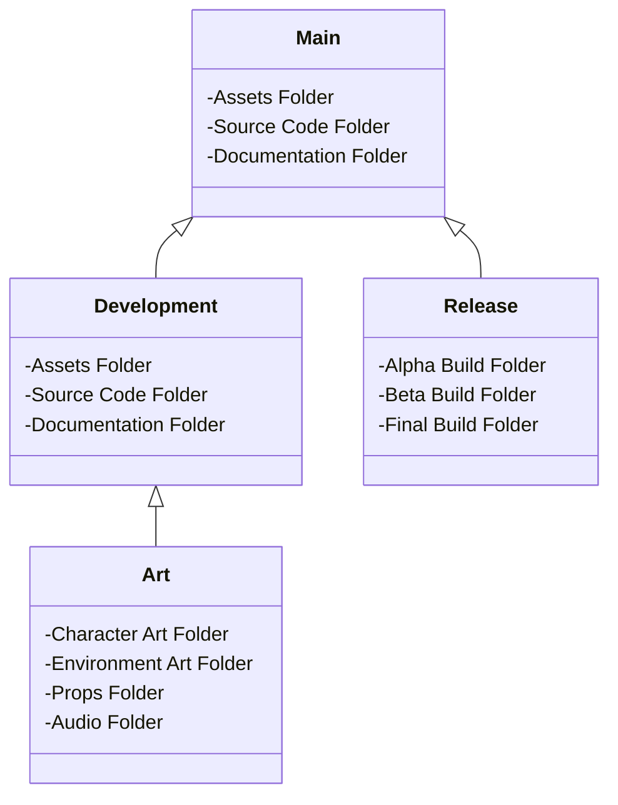
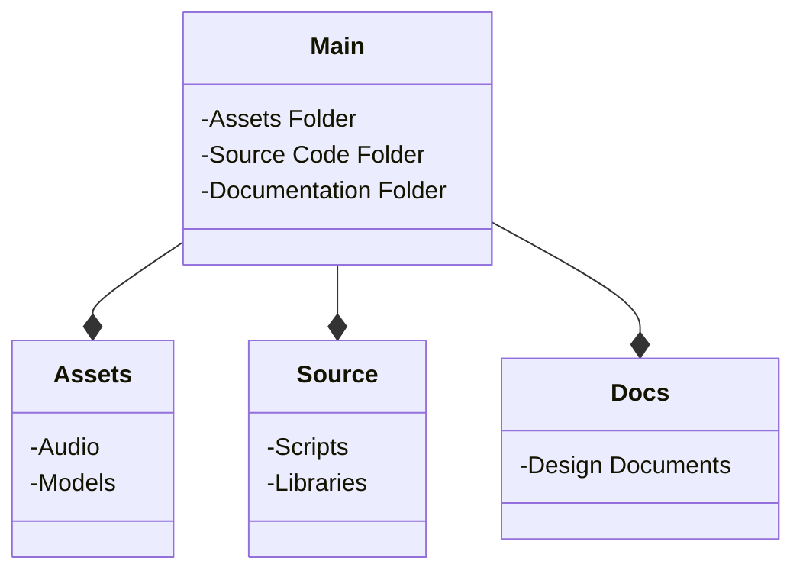
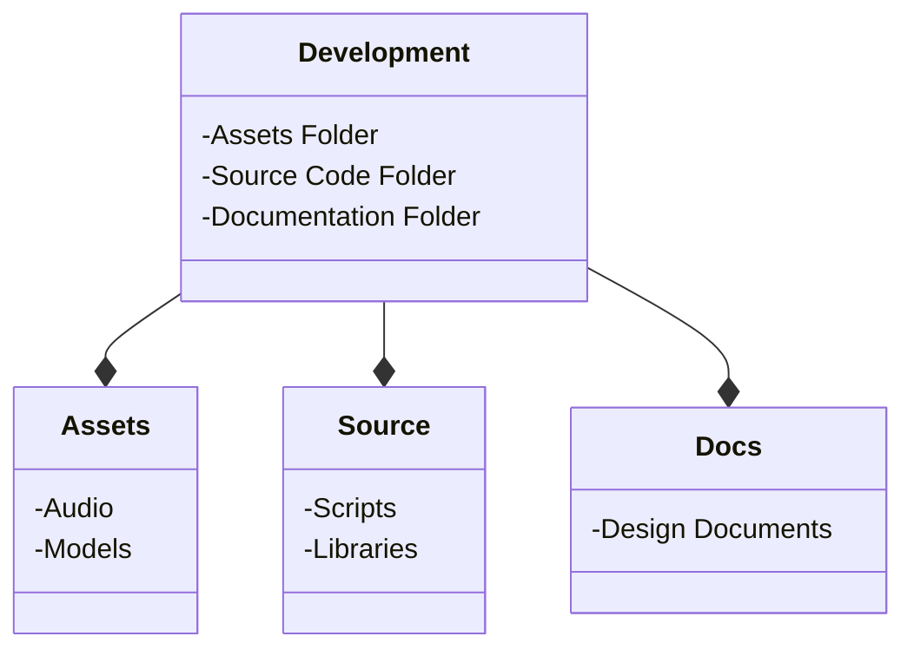
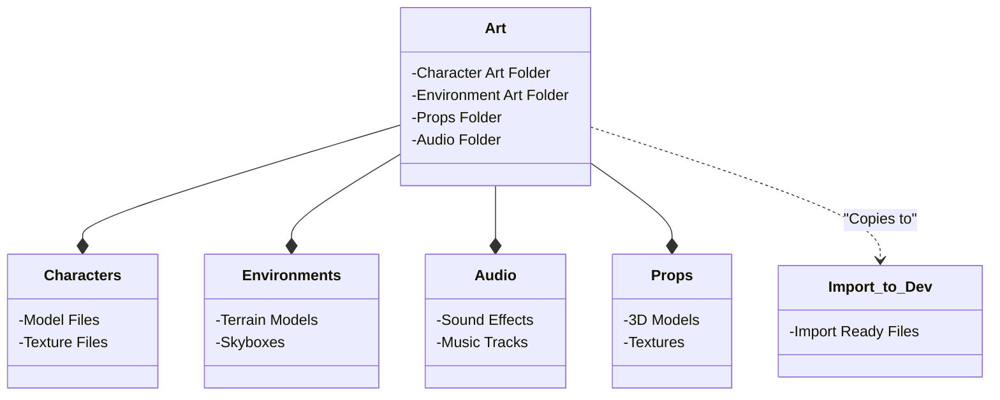
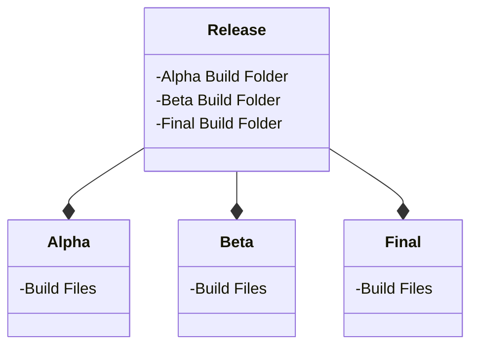

---
{"dg-publish":true,"permalink":"/drexel-perforce/best-practices/depot-structure-game-dev/"}
---

# Optimal Depot Structure for Game Development

Creating an effective depot structure is crucial for streamlining workflows and ensuring the stability of your game development projects. This guide outlines the recommended depot structures and practices for managing different stages of game development using Perforce (P4V).

---

## Mainline Stream (Main)

**Purpose:** Acts as the stable backbone of the project, holding the version of the game that is tested and ready for further release phases. *This stream should have the folder structure of whichever engine is being used (Unity, Unreal, Godot, etc.)*

**Key Practices:**
- **Stability:** Only stable, error-free, and fully operational versions should be merged into the main.
- **Single Stream:** Maintain only one mainline stream to avoid complexity and ensure consistency.
- **Protected Merges:** Never merge experimental or untested changes directly into the main stream.

---
## Development Stream (Dev)

**Purpose:** Serves as the primary workspace for development, where most of the project’s day-to-day activities occur. *This stream should have the folder structure of the mainline stream (project folder structure).*

**Key Practices:**
- **Structure:** Mirrors the main stream’s folder structure to maintain consistency.
- **Controlled Merges:** Only stable and functioning iterations should be merged from dev to main.
- **Multiple Milestones:** Supporting multiple dev streams for different project milestones is recommended, but avoid creating a dev stream for each team member to minimize merge conflicts and errors.

---
## Art Stream (Art)

**Purpose:** Focuses on the development of art assets such as characters, environments, props, and audio. T*his streams structure may vary.*

**Key Practices:**
- **Varied Structure:** The folder structure can vary based on asset categories.
- **Selective Integration:** Only merge or copy necessary and ready-to-import files to the dev stream.
- **Import Folder:** Utilize an 'import to dev' folder to streamline the integration of art assets into the development stream.

---
## Release Streams (Build/Release)

**Purpose:** Dedicated to storing builds for different release stages such as alpha, beta, etc.

**Key Practices:**
- **Isolation:** The release stream should only contain the necessary builds and release folders. 
- **Build Source:** Use this stream for building your releases.
- **No Merging Back:** Never merge changes from the release stream back to the main stream.
- **Multiple Streams:** It's acceptable to have multiple release streams for different release versions.

---
## Virtual Streams

**Purpose:** Provides a personalized or filtered view of the depot and its streams without the need for separate dev streams for each team member.

**Key Practices:**
- **Avoid Individual Streams:** Do not create a new dev stream for each team member to prevent redundancy and confusion.
- **Use of Virtual Streams:** Employ [[Drexel Perforce/Perforce Streams/Virtual Streams\|Virtual Streams]] for individual team members needing a tailored view of the project’s structure and files.
---
## P4Ignore File

**Purpose:** Ensures that only essential files are included in the depot, avoiding unnecessary file tracking and clutter.

**Key Practices:**
- **Regular Updates:** Frequently update the p4ignore file, especially when introducing new software or tools.
- **Leverage Existing Ignores:** Utilize existing ignore configurations (e.g., gitignore) from software packages to configure your p4ignore file effectively.

