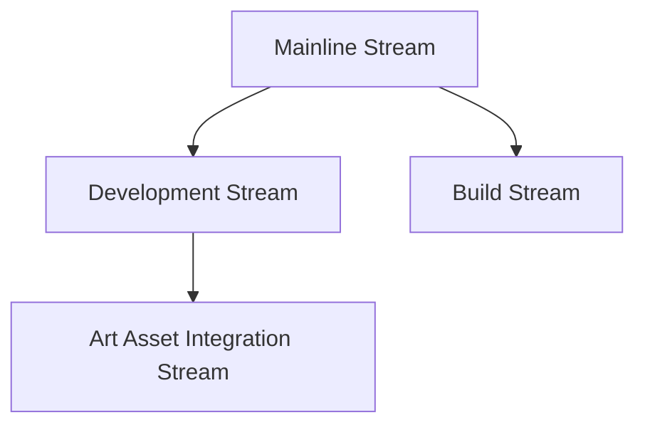

---
{"dg-publish":true,"permalink":"/drexel-perforce/getting-started/installation-guide/"}
---

# 🚀 Perforce Installation Guide for Drexel University

<iframe src="https://1drv.ms/v/s!AqQzGx8l4o2wk-sw3BWtIqtRbhePrw?embed=1" width="640" height="320" frameborder="0" scrolling="no" allowfullscreen></iframe>

---

## Table of Contents
- [[Drexel Perforce/Getting Started/Installation Guide# Connecting to Drexel VPN\|# Connecting to Drexel VPN]]
- [[Drexel Perforce/Getting Started/Installation Guide# P4V Client Installation\|# P4V Client Installation]]
- [[Drexel Perforce/Getting Started/Installation Guide# Setting Up Perforce Streams\|# Setting Up Perforce Streams]]
- [[Drexel Perforce/Getting Started/Installation Guide# Configuring Your Workspace\|# Configuring Your Workspace]]

---
## Connecting to Drexel VPN

> [!IMPORTANT]
> Connecting to the Drexel VPN is **mandatory** before accessing the Perforce server. Ensure you complete this step before proceeding with any Perforce-related tasks.

### 🔒 Step 1: Install Cisco AnyConnect

1. If you haven't already, download and install Cisco AnyConnect from [Drexel's Software Center](https://software.drexel.edu/)
2. Follow the installation prompts to complete the setup

### 🌐 Step 2: Connect to Drexel VPN

1. Open Cisco AnyConnect
2. In the connection field, enter: `vpn.drexel.edu`
3. Click "Connect"
4. Enter your Drexel username and password when prompted
5. If required, complete the Duo two-factor authentication

> [!TIP]
> Keep Cisco AnyConnect running while you work with Perforce. If you disconnect, you'll lose access to the Perforce server.

> [!NOTE]
> For detailed instructions and troubleshooting, visit [Drexel's VPN Guide](https://drexel.edu/it/help/a-z/VPN/)

---

## P4V Client Installation

P4V is the Perforce Visual Client that provides a graphical interface for managing your files and repositories (depots) in Perforce.

### 📥 Step 1: Download

1. Visit the official Perforce downloads page: [Download Helix Visual Client (P4V)](https://www.perforce.com/downloads/helix-visual-client-p4v)
2. Select the version of P4V for your operating system (Windows, macOS, Linux)
3. Click the download button and save the installer to your computer

> [!TIP]
> Make sure to download the latest version to ensure you have all the newest features and security updates!

### 💻 Step 2: Install

1. Locate the downloaded installer and double-click to start the installation process
2. Follow the on-screen instructions:
   - Accept the license agreement
   - Continue with the default installation settings (unless you have specific preferences)
3. Complete the installation

> [!NOTE]
> No initial configuration is needed during the install process. 
> - You may choose to optionally install Helix Core Apps. Installing most apps is recommended. 
> 	- Only those with administrative access need P4Admin (Administration Tool)

---

## Setting Up Perforce Streams

Perforce Streams provide a structured way to manage branches in your projects, making it easier to handle merges and integrations.

### 🔐 Step 1: Accessing P4V

> [!IMPORTANT]
> Ensure you're connected to the Drexel VPN before proceeding. If you haven't connected yet, refer to the [[Drexel Perforce/Getting Started/Installation Guide# Connecting to Drexel VPN\|# Connecting to Drexel VPN]] section above.

1. Launch P4V from your applications or programs list
2. Connect to the Perforce server:
   - Enter the server address: `perforce.westphal.drexel.edu:1666`
   - Log in with your provided credentials (username and password)
      - Username is your Drexel username: `abc123`
      - Default passwords for new users are either `ChangeMe123!` or `TempPass123!`

### 🏗️ Step 2: Creating a Stream Depot

> [!NOTE]
> Most course-related and project-specific depots are pre-established. If you need a new depot, please contact your Professor, Team Lead, or the Perforce administrator.

For Perforce administrators:

1. In the P4V Admin interface, right-click on the ***Depots*** area and select ***New Depot...***
2. Choose ***Stream*** for the Depot Type
3. Name your depot (e.g., "GameDevProjects")
   - For **Unity projects**, prefix with `N_` (e.g., `N_GameDevProjects`)
   - For **Unreal projects**, prefix with `R_` (e.g., `R_GameDevProjects`)
4. Provide a brief description
5. Retain default settings for other properties
6. Click 'OK' to create the depot

### 🌊 Step 3: Creating Your First Stream

1. Navigate to the **Streams** tab (View > Streams or Ctrl/Cmd + 7)
2. Right-click in the window and select ***New Stream...***
3. Select ***Mainline*** as the stream type
4. Name your stream (e.g., `main`) and provide a description
5. Click 'OK' to create the stream

> [!TIP]
> After creating the mainline, set up additional streams for a typical project structure:
> - Development Stream (`//depot/mainline/dev`)
> - Art Asset Integration Stream (`//depot/mainline/dev/art`)
> - Build (Release) Stream (`//depot/mainline/build`)

