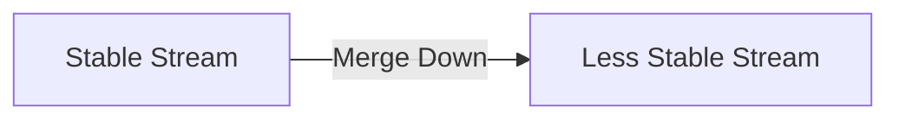
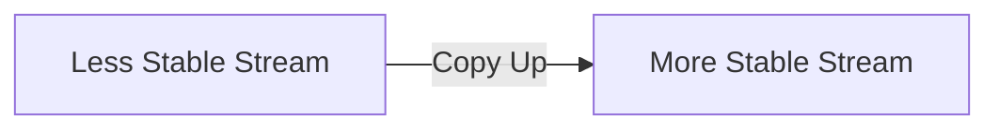
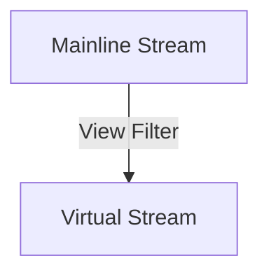

---
{"dg-publish":true,"permalink":"/drexel-perforce/perforce-streams/branching-merging-and-copying-with-streams/"}
---

## Overview

Streams in Perforce are isolated lineages of source files, providing a structured way to manage changes across different scopes of work like features, releases, or bug fixes. This page outlines the key concepts and operations for branching, merging (down), and copying (up) with streams and virtual streams.

## Branching with Streams

"Branching" with streams is simply put, creating a new stream. Either `mainline`, `development`, `release`, or `virtual`, in scope. Branching in streams allows developers to diverge from the main line of development to work on features or fixes in parallel, without affecting the main codebase.

### Creating a Stream
Steps for creating a new stream can be found in [[Drexel Perforce/Getting Started/Installation Guide - Legacy\|Installation Guide - Legacy]].

## Merging with Streams

Merging integrates changes from one stream to another, typically from feature streams back to the mainline or parent stream, ensuring that new developments are incorporated into the broader project.

### Merging Changes
To merge changes down to a less stable stream:

1. In the Streams tab, right-click the target stream and choose **Merge/Integrate to target_stream…** or double-click and choose **Merge changes**.
2. Ensure you are working in the target stream, as changes must be merged down or copied up while in the target stream.
3. If prompted, select or create a workspace for the target stream.
4. The **Merge/Integrate** dialog will appear. Verify that the correct source and target streams are specified.
5. For additional details about the Merge/Integrate dialog, refer to the documentation on "Merge files between codelines."
6. (Optional) To specify how the merge is to be resolved, click **Resolve and Submit**.
7. To enable specific `p4 resolve` flags, click **Advanced**.
8. Click **Merge**.
9. If necessary, resolve the merges manually, then submit the resulting changelist.

### Diagram: Merging Workflow

## Copying with Streams

Copying is used to create an exact replica of one stream into another. This is often used to seed new development lines or archive existing states.

### Copying a Stream
When copying changes up to a more stable stream, you are propagating a duplicate of the less stable stream.

1. In the Streams tab, right-click the target stream, or double-click the stream and select **Copy changes**.
2. If prompted, select a workspace for the target stream.
3. Ensure you are working in the target stream as required when merging down or copying up.
4. In the **Copy** dialog, review the propagation information or refine the operation using the options on the **Filter**, **Submit**, and **Advanced** tabs.
5. To propagate changes to the more stable stream, click **Copy** and submit the resulting changelist.

### Diagram: Copying Workflow

## Virtual Streams

Virtual streams do not host file content but instead serve as a view or a filter of another stream. You merge changes down or copy changes up to a virtual stream just as you would to a real stream, however the merge or copy is actually submitted to the virtual stream’s base parent. *You might find it more straightforward to copy and merge directly between real streams.*
### Diagram: Virtual Streams

---

 **Official Helix Core Documentation: Merge Down/Copy Up** - https://www.perforce.com/manuals/p4v/Content/P4V/streams.merge_copy.html#Merge_down_and_copy_up_between_streams
 
 **Official Helix Core Documentation: Managing Codelines** - https://www.perforce.com/manuals/p4v/Content/P4V/chapter.branches.html