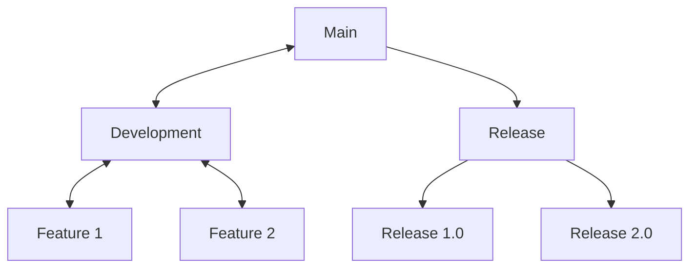
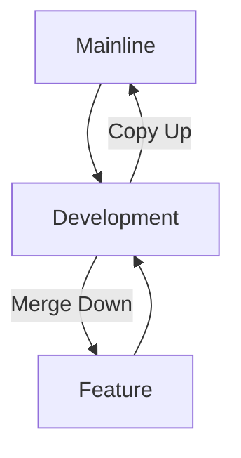
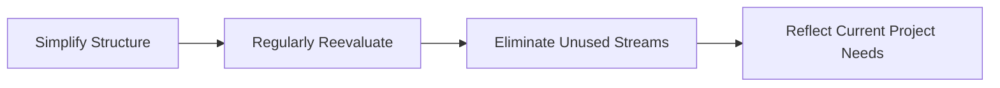
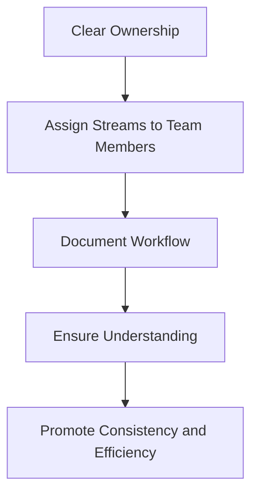

---
{"dg-publish":true,"permalink":"/drexel-perforce/perforce-streams/working-with-streams/"}
---

Perforce Streams offer a dynamic and structured approach to version control, enabling teams to manage their development processes more effectively. This document dives deeper into working with Streams, emphasizing the rationale behind their design, introducing more advanced workflows, and outlining best practices for optimizing your version control strategy. 

Understanding these concepts will empower you to leverage Streams fully, ensuring your project's organization and efficiency are maximized.

#### Advanced Streams Workflows

##### Branching Strategies

Understanding and implementing effective branching strategies is crucial in managing complex development projects. Streams support several branching strategies, including:

- **Mainline Branching**: A ***single*** mainline (or trunk) stream serves as the project's backbone, with development and release streams branching off. This strategy is ideal for continuous integration and simplifies merging by centralizing the integration process.
- **Development Branching**: For new features, building, and experiments, utilize the development streams and sub-streams (like for ART). Or create specific feature virtual streams off the development stream. This isolates work until it's ready to be merged back, minimizing disruption to the mainline.
- **Release Branching**: Use release streams to prepare for a product launch. This isolates stabilization efforts from ongoing development, allowing teams to focus on bug fixes and performance improvements without introducing new features.
- **Virtual Branching**: Use virtual streams to create a lightweight, derived view of another stream without duplicating files or metadata. This approach enables seamless context switching and exploration of alternative development paths: ideal for scenarios requiring rapid prototyping, code review, or temporary adjustments.

##### Stream Inheritance and Integration

Stream inheritance simplifies merging and integration by defining clear paths for change propagation. Here's why understanding stream hierarchy is essential:

- **Merge Down, Copy Up**: This best practice ensures changes are merged down to less stable streams for testing and then copied up to more stable streams, preserving stability in your mainline and release streams.
- **Task Streams**: For short-lived tasks or bug fixes, the use of virtual streams as task streams can offer a lightweight branching option that inherits from their parent stream. They're ideal for work that doesn't warrant a full feature branch.

---
#### Best Practices for Using Streams

##### Streamline Your Streams Setup

- **Simplify Structure**: Avoid overcomplicating your streams hierarchy. A simpler structure makes it easier to manage and understand, reducing the likelihood of errors. KEEP STREAMS TO A MINIMUM.
- **Regularly Reevaluate**: As projects evolve, so should your streams structure. Regularly review and adjust your streams to reflect current project needs and eliminate unused or obsolete streams.

##### Efficient Merging and Integration

- **Utilize P4V Visual Tools**: P4V provides visual tools for merging and integrating changes. These tools help identify potential conflicts and streamline the merge process, making it more manageable and less error-prone.
- **Test Before Integrating**: Always test changes in a less stable stream before integrating them into more stable streams. This practice helps catch issues early, reducing the risk of destabilizing your mainline or release streams.

##### Collaboration and Communication

- **Clear Ownership**: Assign clear ownership of streams to team members. This clarifies responsibilities and helps prevent conflicts during merging and integration.
- **Document Workflow**: Document your team's workflow and stream strategy. A clear, accessible guide ensures everyone understands how to work within your streams setup, promoting consistency and efficiency.

##### Handling Large Assets and Files

- **Use .p4ignore Wisely**: Leverage .p4ignore files to exclude unnecessary files or directories from version control, keeping your streams clean and focused on relevant assets.
- **Optimize Asset Storage**: Consider using Perforce Helix Core's capabilities for handling large binary files, such as Lazy Copying and Archive Depots, to optimize storage and improve performance.
	- Lazy copying in Helix Core means that only one physical copy of a file is stored on the server.
	- Archive depots allow archiving old, infrequently accessed file revisions off to cheaper external storage.

---
### Official Helix Core/P4 Documentation:

https://help.perforce.com/helix-core/quickstart/Content/quickstart/admin-create-depot.html
https://help.perforce.com/helix-core/quickstart/Content/quickstart/admin-create-stream.html