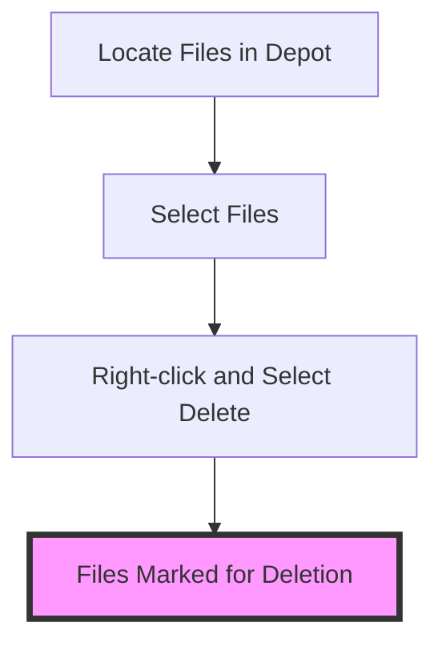
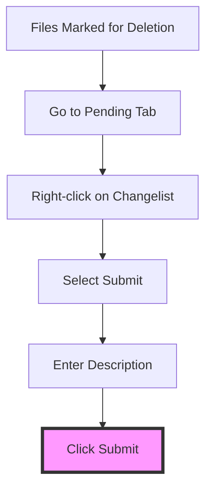
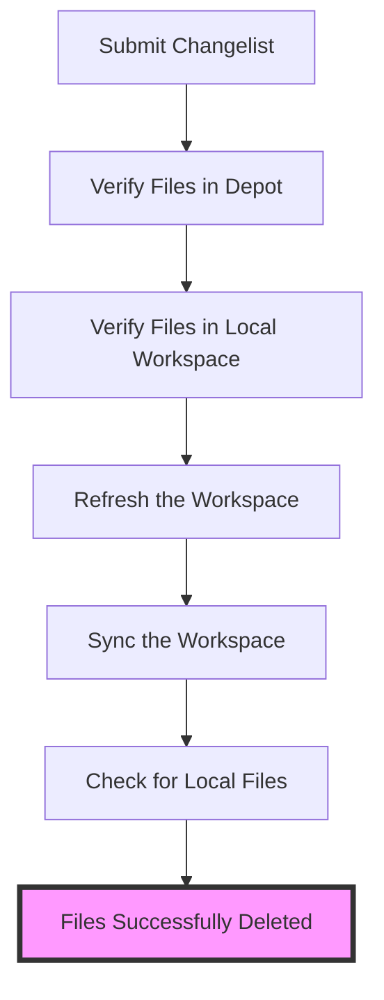

---
{"dg-publish":true,"permalink":"/drexel-perforce/tutorials-and-examples/deleting-files/","noteIcon":""}
---

## Proper Workflow for Deleting Files in P4V for Projects

When working with Perforce P4V, it's essential to follow the correct workflow to delete unwanted files from your project/depot. This ensures that your project remains clean and avoids unnecessary complications. Below is a step-by-step guide on how to properly delete files in P4V, *including handling files in the local file system.*

### Step 1: Open P4V and Connect to the Depot

1. **Launch P4V (Perforce Visual Client)**.
2. **Connect to your Perforce server** by entering your server address, username, and password.
3. **Navigate to your workspace** where your project files are located.

### Step 2: Locate the Files to Delete

1. In the **Depot tab**, navigate to the file(s) you want to delete.
2. **Select the file(s)**. You can select multiple files by holding the `Ctrl` key (Windows) or `Command` key (Mac) while clicking on the files.

### Step 3: Mark the Files for Deletion

1. **Right-click** on the selected file(s).
2. Choose **"Delete"** from the context menu. This will mark the file(s) for deletion in your workspace.

### Step 4: Submit the Change

1. After marking the files for deletion, go to the **Pending tab**.
2. You will see a new changelist created with the files marked for deletion.
3. **Right-click** on the changelist and select **"Submit"**.
4. **Enter a description** for your changelist, explaining why you are deleting these files.
5. Click **"Submit"** to apply the changes to the depot.

### Step 5: Verify the Deletion

1. Navigate to the **Depot tab** and ensure the files are no longer present.
2. Check your workspace to confirm the files have been removed locally as well.

### Handling Files in the Local File System

After submitting a changelist that marks files for deletion, P4V should automatically handle the removal of these files from both the depot and your local workspace. However, if you notice that the files are still present locally after submitting the changelist, follow these steps:

1. **Refresh the Workspace**:
   - After submitting the changelist, **refresh your workspace** in P4V. Right-click on your workspace and select **"Refresh"**.
2. **Sync the Workspace**:
   - To ensure your workspace reflects the latest state of the depot, right-click on your workspace and select **"Get Latest Revision"** or **"Sync"**. This should remove any files that have been deleted from the depot from your local file system as well.
3. **Check for Local Files**:
   - Verify if the files have been removed from your local file system. If they are still present, it might be due to synchronization issues.

### Important Tips

- **Do Not Delete Files Directly from the File System**: Deleting files directly from your local file system without using P4V will cause inconsistencies in your depot and workspace.
- **Check for File Dependencies**: Ensure that the files you are deleting are not required by other parts of the project. Deleting essential files can break the build or cause other issues.
- **Communicate with Your Team**: Inform your team members about the deletion, especially if the files are part of a shared project. This prevents confusion and potential conflicts.
- **Avoid Manual Deletion**: Manually deleting files from the local file system without using P4V can lead to discrepancies between your local workspace and the depot. Always use P4V to manage file deletions to maintain consistency.

### Troubleshooting

- **File Still Visible in Depot**: If a deleted file is still visible in the depot, refresh the view or check if the changelist submission was successful.
- **Cannot Delete File**: If you encounter permissions issues or other errors, contact your Perforce administrator for assistance.

---

### Official Helix Core Documentation - Deleting Files - https://www.perforce.com/manuals/p4v/Content/P4V/files.delete.html 